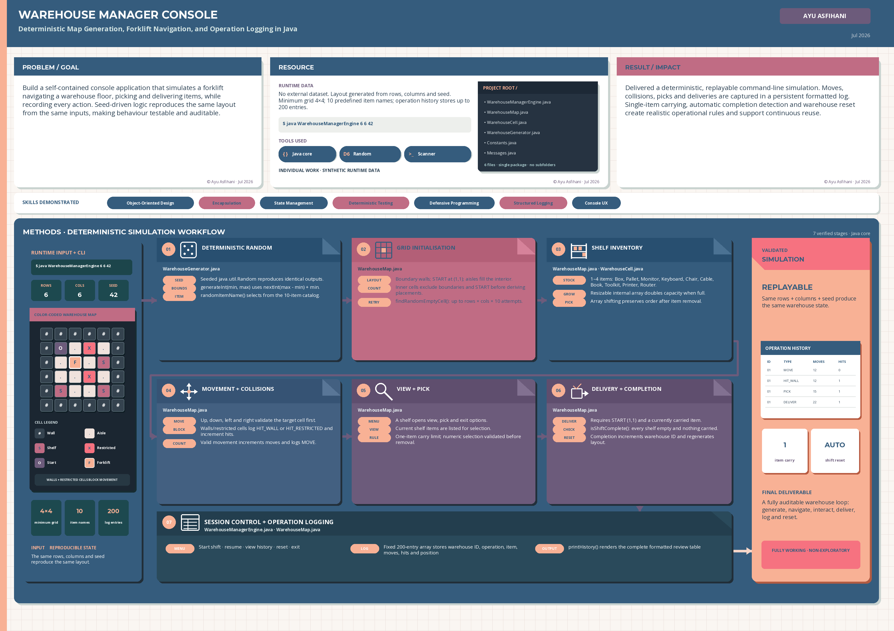

Copyright (c) 2026 Ayu Asfihani, 24 July 2026

# Warehouse Manager Programming

## Problem/Goal

Design and build a deterministic, menu-driven console application that simulates a forklift navigating a warehouse floor, picking and delivering items from shelves, and logging every action for later review. The goal was a fully self-contained Java program, no external frameworks or datasets, where the same starting parameters always reproduce the same warehouse layout.

## Resource

Built entirely as a self-contained Java console application. The warehouse layout is generated at runtime from three command line parameters: grid rows, grid columns, and a random seed. The seed drives a wrapped `java.util.Random` instance, so the same three inputs always reproduce an identical layout. Item names come from a fixed in-code catalog of ten warehouse item types (Box, Pallet, Monitor, Keyboard, Chair, Cable, Book, Toolkit, Printer, Router). Minimum warehouse size is 4x4 cells.

## Methods

1. **Deterministic map generation.** A seeded random wrapper produces bounded random integers used throughout generation. The grid is initialised with boundary walls, a fixed START cell at (1,1), and aisle cells everywhere else. Shelf and restricted-cell counts are calculated from the available inner cell count, then placed at randomly sampled empty aisle positions using a bounded retry loop to avoid infinite searches once the grid fills up.
2. **Shelf population.** Each placed shelf is stocked with a random count of items (1 to 4) drawn from the ten-item catalog, stored in a resizable array on each cell.
3. **Forklift movement and state tracking.** Direction-based movement (up, down, left, right) is blocked by walls and restricted cells, with wall hits and restricted-area hits logged separately. A single-item carry constraint means an item must be delivered before another can be picked, and delivery is only permitted while standing on the START cell.
4. **Menu-driven session control and operation logging.** A main menu (start shift, resume shift, view history, reset shift, exit) sits above a shift loop and a shelf sub-menu (view items, pick item, exit). Every action is logged to a 200-entry history buffer and printed as a formatted table, with automatic shift completion detection once all shelves are emptied, followed by an automatic warehouse reset.

## Result/Impact

Delivers a fully deterministic, replayable warehouse simulation controllable entirely from the command line, with a persistent operation log usable for auditing forklift activity (moves, wall hits, restricted-area hits, item picks and deliveries) across a full shift.

## Tools used

Java (core language only, no external libraries), `java.util.Random` for seeded generation, `java.util.Scanner` for console input.

## Limitations/next steps

Single floor only, a single implicit user with no login or role separation, and a fixed 200-entry history buffer. These constraints were the direct motivation for the companion Advanced Warehouse Manager Programming project, which adds multiple floors, role-based employee logins, file-based warehouse and payroll data, and an automated payroll calculation engine.

---

This repository contains the summary poster and licensing terms only. For the full runnable source, get in touch via the contact details on my LinkedIn profile.
